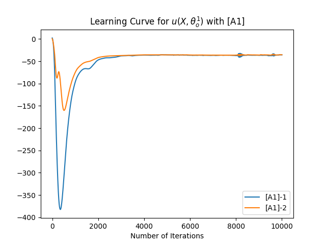
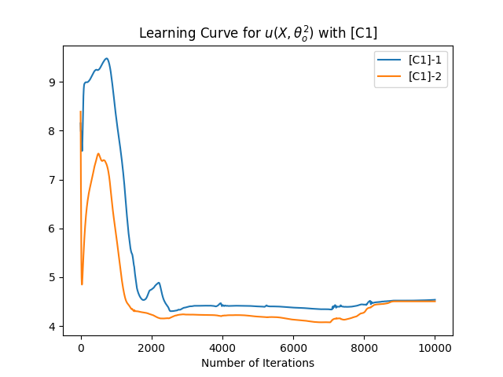
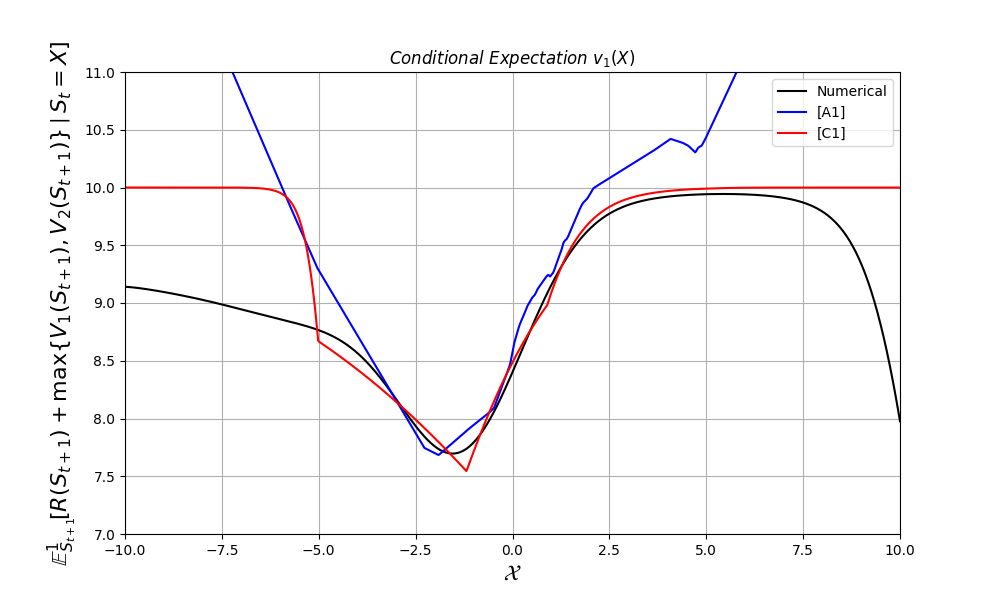
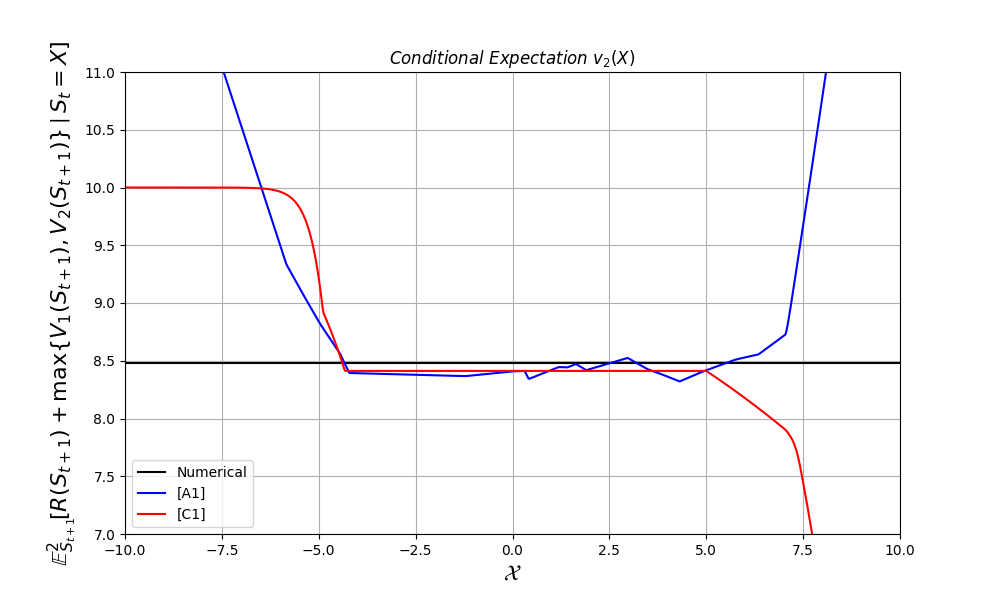
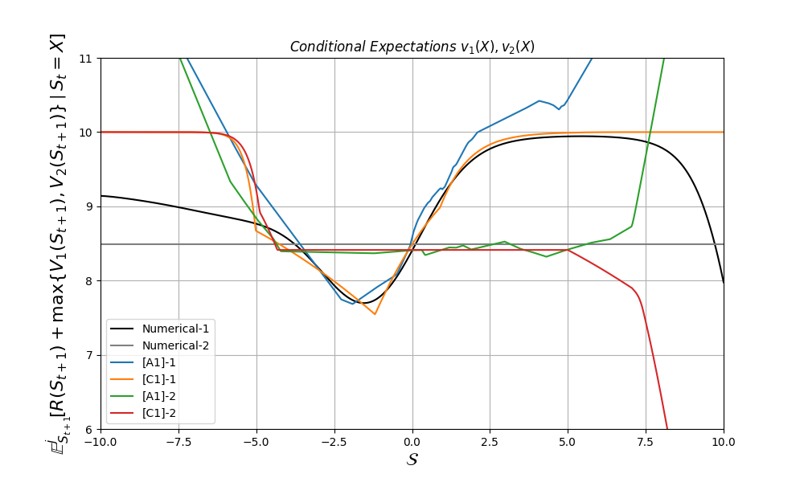
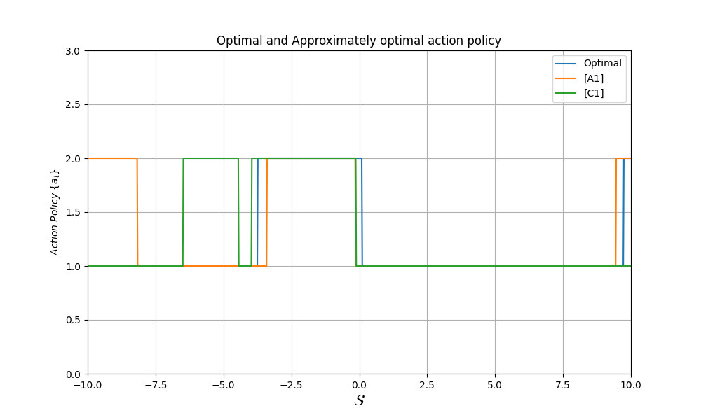

# Reinforcement Learning Optimal Policy Estimation with Infinite future reward

This repository implements the numerical and data-driven approaches to solve the infinite future reward with exponential discount factor γ = 0.8 reinforcement learning problem. Specifically, it computes the optimal functions 𝜈1(𝑆) and 𝜈2(𝑆) using numerical methods, and then applies a data-driven approach to obtain approximations 𝜔(𝑢(𝑋,𝜃)) using neural networks. The data-driven approach utilizes two sets of pairs, with the functions [A1] and [C1] applied for approximation.

## Problem Overview

The problem involves a Markov decision process with two possible transition densities depending on the action 𝑎:

- For 𝑎𝑡=1: 𝒮𝑡+1=0.8𝒮𝑡+1.0 + 𝑊𝑡

- For 𝑎𝑡=2: 𝒮𝑡+1=−2.0 + 𝑊𝑡
   
Where 𝑊𝑡∼𝑁(0,1).

At each new state, a reward 𝑅(𝒮) = 𝑚𝑖𝑛{2,𝒮^2} is received. The goal is to solve for the optimal action policy that maximizes the expected reward.

## Methodology

### Numerical Approach

Numerical solutions are computed for the expected rewards using the transition functions and the reward function. For a sampling interval `{s_0, ..., s_n}`, the vectors are defined as:

`V_j = [ ν_j(s_0), ..., ν_j(s_n) ], R = [ ℛ(s_0), ..., ℛ(s_n) ]`

The matrices `ℱ_j`, for `j = 1, 2`, are calculated based on the difference in transition probabilities:

𝑖=2,…,𝑛−1

Then 𝑉𝑗 = ℱ𝑗(𝑅 + 𝛾 𝑚𝑎𝑥{𝑉1, 𝑉2}), 𝑗 = 1,2. Where max{𝑉1,𝑉2} is taken horizontally on the corresponding elements of the vectors.

The iterative solution of the equation, starting with 𝑉1, 𝑉2 zero vectors, leads to the optimal solution for 𝑉1, 𝑉2.

### Data-Driven Approach

The data-driven approach uses neural networks 𝑢(𝑋,𝜃𝜊^𝑗) to approximate 𝜈𝑗(𝑋) i.e., 𝜔(𝑢(𝑋,𝜃𝜊^𝑗)) ≈ 𝜈𝑗(𝑋). The networks are trained to approximate the expected rewards for each state. The optimization algorithm used is Gradient Descent.

### Conditional Expectation Functions

For the data-driven approach, we apply the function families [A1] and [C1]:

- **[A1]**: 
  - 𝜔(𝓏) = 𝓏, 
  - 𝜌(𝓏) = −1,
  - 𝜑(𝓏) = z^2 / 2,
  - 𝜓(𝓏) = −𝓏 

- **[C1]**:
  - 𝜔(𝓏) = 𝑎 / (1+𝑒^𝓏) + 𝑏 / (1+𝑒^𝓏),
  - 𝜌(𝓏) = − 𝑒^𝓏 / (1+𝑒^𝓏),
  - 𝜑(𝓏) = (𝑏−𝑎) / (1 + 𝑒^𝓏)+ 𝑏 log(1+𝑒^𝓏),
  - 𝜓(𝓏) = −log(1+𝑒^𝓏)

### Comparison and Results

After generating 1000 random actions with a 50% chance for each action 𝑎𝑡=1 or 𝑎𝑡=2, the states {𝑆_1,…,𝑆_1001} are created. These sets are used to train the neural networks for approximating 𝜈1(𝑋) and 𝜈2(𝑋) using the respective data sets.

The neural networks used are of a single hidden layer with 100 neurons and ReLU activation functions. The Gradient Descent learning rate is set to 0.001.

The results demonstrate that the neural network approximations converge well to the numerical solution, with the optimal policy derived from the comparison of 𝜈1(𝑆𝑡) and 𝜈2(𝑆𝑡).

### Results

#### 1. Learning curve of 𝑢(𝑋,𝜃^𝑗) using [A1]

The following plots shows the learning curve for 𝜈1(𝑆) and 𝜈2(𝑆) with [A1].

   

      
   

#### 2. Learning curve of 𝑢(𝑋,𝜃^𝑗) using [A1] and [C1]

The following plots shows the learning curve for 𝜈1(𝑆) and 𝜈2(𝑆) with [C1].

   

      
   

#### 3. Approximations of 𝜈1(𝑆) and 𝜈2(𝑆)

The following plots show the approximations for 𝜈1(𝑆) and 𝜈2(𝑆) obtained from both the numerical method and the neural network (NN) approximation.

- Approximations of 𝜈1(𝑆) 

   

      
   

- Approximations of 𝜈2(𝑆) 

   

      
   

The black curve represents the numerical solution, while the blue and red curves represent the neural network approximations using [A1] and [C1], respectively. 

Neural networks approximate the numerical solution very well in [-5,5], but outside this range they show divergence.

#### 4. Comparison of Numerical and Neural Network Approximations of 𝜈1(𝑆) and 𝜈2(𝑆)

This graph shows the comparison between the numerical solutions and the neural network approximations for both 𝜈1(𝑆) and 𝜈2(𝑆). 

   

      
   

#### 5. Optimal Action Policy

Finally, the optimal action policy based on the values of 𝜈1(𝑆) and 𝜈2(𝑆) is shown below.  The policy chooses 𝑎𝑡=1 if 𝜈1(𝑆𝑡) > 𝜈2(𝑆𝑡) and 𝑎𝑡=2 otherwise.

   

      
   

   
### Conclusion

The data-driven approach using neural networks provides good approximations to the optimal functions and action policies, showing that the use of functions [A1] and [C1] successfully estimates the conditional expectations in this reinforcement learning problem.

## Installation

To clone the repository:

        git clone https://github.com/orestis-koutroumpas/Reinforcement-Learning-Optimal-Policy.git

### Dependencies

- Python 3.x
- NumPy
- Matplotlib
- Scipy
